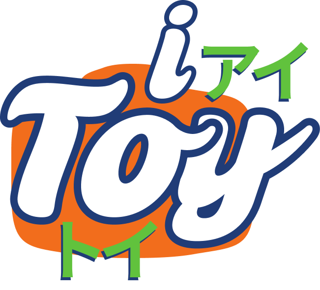
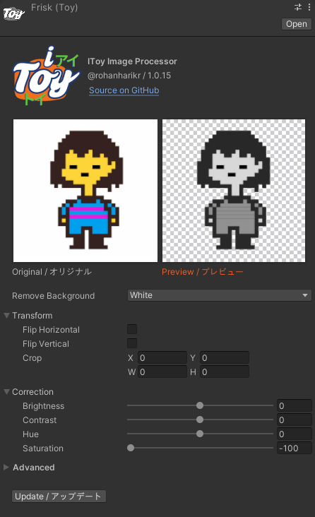

 
<h3 align="center">Your friendly neighbourhood non-additive image processor for Unity!</h3>
 

https://github.com/rohanharikr/IToy/assets/12775813/cb745359-13a3-4a3b-9c24-acd5a0e8fd0a

## Features 

- Remove background color
- Flip horizontal/vertical
- Crop (All sides)
- Color correction (Brightness, Contrast, Hue, Saturation)
- Non-additive (Changes are always based on the original image)
- Non-destructive (Revert to the original image anytime)

## Installing

#### Package Manager (recommended)

1. Open the package manager ("Window" > "Package Manager")
1. Click on the plus icon and "Add package from git URL..."
1. Enter https://github.com/rohanharikr/IToy.git and click "Add"
1. Wait until the package manager finishes installing the package and recompiling

#### Importing Package

1. Download the [latest release](https://github.com/rohanharikr/IToy/releases)
1. Double-click the .unitypackage or import it
   
#### Manual 

1. Dowload this repository as a zip file, extract the archive
1. In Unity, go in "Window" > "Package Manager" > "Add Package from disk"
1. Select the "package.json" file located at the root of the package folder

## Using

1. Right-click any image from the Project Window > IToy > [Select any quick setting you want]
2. Play with the toy file in the inspector
3. Click on "Update" button to write changes to the image file

---

Thanks to Reddit user [zaraishu](https://www.reddit.com/user/zaraishu/) for help with the Japanese transliterations!
